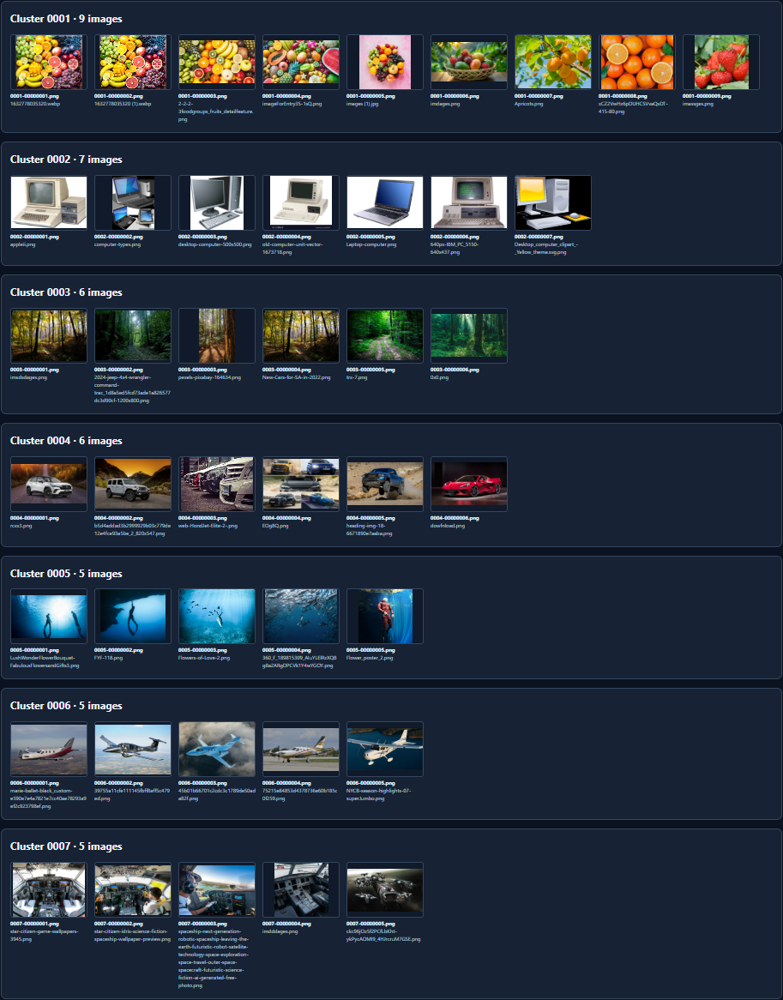

# Image File Classifier


<p align="center">
  
</p>

A Windows CLI tool that groups images by visual similarity and saves them as full-resolution PNGs. Each filename contains a cluster number and an index, so related images appear together when you sort the output folder by name.

Runs as a single portable **`imageclassifier.exe`**. The Python runtime, image libraries, and model are bundled inside the executable. Processing runs locally on the CPU, with no Python installation, GPU, account, or network connection required on the target PC.

The application runs in a terminal and produces PNG files plus a CSV manifest.

## 📑 Table of Contents

- [🚀 Quick Start](#-quick-start)
- [⌨️ Command Line Workflow](#-command-line-workflow)
- [🎨 Adjusting the Groups](#-adjusting-the-groups)
- [📖 CLI Reference](#-cli-reference)
- [📄 Output and Manifest](#-output-and-manifest)
- [🖼️ Supported Images](#-supported-images)
- [🏗️ Architecture](#-architecture)
- [🐍 Run from Source](#-run-from-source)
- [🔨 Build the Executable](#-build-the-executable)
- [📦 Automated Releases](#-automated-releases)
- [📁 Project Structure](#-project-structure)
- [📐 How Similarity Is Calculated](#-how-similarity-is-calculated)
- [🧭 Current Version and Future Work](#-current-version-and-future-work)
- [📜 Licence](#-licence)

## 🚀 Quick Start

Download `imageclassifier.exe` from the [latest release](https://github.com/rohingosling/image-file-classifier/releases/latest). Place it in a folder, open **PowerShell** there, and run:

```powershell
.\imageclassifier.exe -s "C:\images" -d "C:\images-classified"
```

This reads the images directly inside `C:\images`, groups them, and creates `C:\images-classified` with PNG outputs and `manifest.csv`. Your source files stay unchanged.

Use a destination outside the source folder. A destination such as `C:\images\classified` is rejected.

## ⌨️ Command Line Workflow

1. Choose a source folder and a separate destination. Quote paths that contain spaces.
2. Run the command to write the grouped PNGs and manifest. Add `--recursive` to include images in subfolders.
3. Inspect the resulting PNGs to review the groups. Use the manifest to trace each output back to its source.

For a collection spread across subfolders:

```powershell
.\imageclassifier.exe -s "C:\My Images" -d "C:\My Images Classified" --recursive
```

The terminal first shows the version and effective settings, then progress for decoding, feature extraction, and classification. Each stage shows a percentage and elapsed time; classification includes writing the PNGs and manifest. Redirected output keeps one completion line per stage. The final summary reports the number of images read, grouped, and skipped. Unsupported or unreadable files are reported and included in the manifest.

Existing output names and manifests are never overwritten. Use a fresh destination when trying another set of options. Unrelated files may remain in the destination.

**Collection limit:** up to **2,000 supported-extension files per run**, including unreadable files. The limit includes recursive descendants when `--recursive` is enabled. Larger collections must be split into separate folders; each run computes its own groups.

## 🎨 Adjusting the Groups

Two options control visual grouping:

| Option | Default | Effect |
| --- | --- | --- |
| `--threshold` | `0.35` | Lower values favour tighter, more numerous groups. Higher values allow broader groups. |
| `--color-weight` | `20` | Percentage of similarity contributed by colour. Content features contribute the remainder. |

For tighter groups:

```powershell
.\imageclassifier.exe -s "C:\images" -d "C:\images-tight" --threshold 0.25
```

To give colour more influence:

```powershell
.\imageclassifier.exe -s "C:\images" -d "C:\images-colour" --color-weight 40
```

`--color-weight 0` uses content features for semantic grouping; `--color-weight 100` uses colour histograms. Decimal percentages such as `37.5` are accepted. Both endpoints still load the model and extract both feature blocks. These options do not change the independent near-duplicate checks.

The legacy option `--alpha 0.80` means 80% content and 20% colour. Use either `--alpha` or `--color-weight` in a command; supplying both is an error.

Grouping is based on visual similarity, so results can include mistaken joins or splits. Diagrams, screenshots, documents, and photographs of related subjects may need different settings. Iterative improvements to grouping quality are planned for future versions.

## 📖 CLI Reference

```text
imageclassifier.exe -s <source> -d <destination> [options]
```

| Argument | Default | Description |
| --- | --- | --- |
| `-s`, `--source` | Required | Folder containing input images. |
| `-d`, `--dest` | Required | Destination for grouped PNGs. |
| `--threshold` | `0.35` | Finite, non-negative average-linkage cosine distance cut. |
| `--color-weight` | `20` | Colour contribution from `0` to `100` percent. |
| `--alpha` | Equivalent to `0.80` | Legacy content contribution from `0` to `1`; mutually exclusive with `--color-weight`. |
| `--recursive` | Off | Include source subfolders. Directory links and junctions are not followed. |
| `--manifest` | `<dest>/manifest.csv` | Custom path for the CSV mapping. |
| `--model` | Bundled model | Override with a compatible local ONNX feature extractor. |
| `-h`, `--help` | — | Print help and exit. |

Source and destination accept Windows or forward-slash paths. The destination and custom manifest must be outside the source folder. Existing output targets and impossible file/directory layouts are rejected before writing.

A model override must accept dynamic batches of float32 `[N, 3, 224, 224]` images and return float32 `[N, 576]` embeddings. Inference uses `CPUExecutionProvider`.

### Exit codes

| Code | Meaning |
| --- | --- |
| `0` | Success. |
| `2` | Invalid arguments or paths, output collision, oversized collection, or no readable images. |
| `3` | Model load, signature, or inference failure. |
| `4` | Output write failure. |

## 📄 Output and Manifest

Output filenames use a four-digit cluster number and an eight-digit index, both starting at one:

```text
0001-00000001.png
0001-00000002.png
0002-00000001.png
manifest.csv
```

Clusters are numbered by descending image count, with source-relative paths breaking ties. Within each cluster, images are ordered by distance to the cluster's normalised mean feature vector, then by source-relative path. If that mean is zero, ordering uses the member with the smallest total cosine distance to the others. A cluster number identifies a group within that run; it is not a permanent category label.

The manifest records the mapping back to your originals:

```csv
cluster,index,output_name,source_path,distance_to_centroid,skipped_reason
```

| Field | Contents |
| --- | --- |
| `cluster` | Group number. |
| `index` | Image position within the group. |
| `output_name` | Generated PNG filename. |
| `source_path` | Source-relative path, preserving case and using `/` separators. |
| `distance_to_centroid` | Cosine distance used to order the image within its group. |
| `skipped_reason` | Explanation for an unsupported or unreadable input. |

Skipped files appear first with their source path and reason; their other fields are empty. Successful rows follow in output-name order. CSV quoting preserves commas and Unicode in filenames.

Images are written at their original resolution after orientation and RGB conversion. On a write failure, completed PNGs and their manifest rows are retained, and the incomplete new PNG is removed. Keep source files and directory aliases unchanged while a run is in progress.

## 🖼️ Supported Images

Accepted extensions are case-insensitive:

| Format | Extensions |
| --- | --- |
| JPEG | `.jpg`, `.jpeg` |
| PNG | `.png` |
| WebP | `.webp` |
| Windows bitmap | `.bmp` |
| TIFF | `.tif`, `.tiff` |

EXIF orientation is applied before feature extraction and output. Palette and grayscale images become RGB. Transparency is composited onto white, and multi-frame images use the first frame.

Unreadable or truncated files are skipped while readable files continue through the pipeline. If no image can be read, the program exits with code `2`. AVIF, GIF, SVG, and video files are outside the accepted input set.

## 🏗️ Architecture

The application is a Python package frozen into one Windows console executable.

| Stage | Responsibility |
| --- | --- |
| Discover and decode | Validate paths, enforce the collection limit, orient images, and convert to RGB. |
| Extract features | Run MobileNetV3-Small on the CPU and compute colour and duplicate signals. |
| Group duplicates | Confirm candidate pairs and form conservative complete-link groups. |
| Cluster | Apply average-linkage agglomerative clustering to duplicate-group representatives. |
| Name and write | Assign deterministic names, validate the complete output plan, then write PNGs and CSV rows. |

ONNX inference runs in batches of at most eight prepared images. Each full-resolution image is closed after feature preparation; compact features remain for clustering. The writer re-decodes sources individually to preserve full-resolution output.

Pillow handles image decoding and conversion, NumPy handles feature arrays, scikit-learn performs clustering, and ONNX Runtime executes the bundled model. PyInstaller packages the interpreter, model, libraries, and native DLLs into the executable.

## 🐍 Run from Source

Requires **Python 3.12 or later**. The tested Windows build environment uses **Python 3.12 x64**.

From the repository folder, create a virtual environment and install the project:

```powershell
py -3.12 -m venv .venv
.\.venv\Scripts\python.exe -m pip install -r requirements.txt
.\.venv\Scripts\python.exe -m pip install -e .
```

Run the module:

```powershell
.\.venv\Scripts\python.exe -m classifyimages -s "C:\images" -d "C:\images-classified"
```

The package also installs a `classifyimages` console command in the virtual environment. Dependency installation requires access to the packages; image processing itself runs offline. The ONNX model is included in the source tree and does not need to be downloaded at startup.

## 🔨 Build the Executable

Set up the environment above, then run:

```powershell
.\build.bat
```

You can also double-click `build.bat` in Windows Explorer. It uses the pinned PyInstaller from `.venv` and the checked-in `classifyimages.spec` to produce a one-file console build.

The result is **`dist/imageclassifier.exe`**. Copy that file to the target PC; the model and dependencies are embedded inside it. Build intermediates are kept under `build/pyinstaller/`.

The executable has been tested after being copied into a directory containing only that file. The build uses the CPU runtime throughout.

## 📦 Automated Releases

The [Windows executable workflow](.github/workflows/windows-release.yml) builds on pushes to `main`, pull requests targeting `main`, and manual runs from the Actions tab. It uses `windows-2022` with Python 3.12 x64, runs `build.bat`, checks the bundled payload, and exercises image conversion from a directory containing only the executable. The verified `imageclassifier.exe` and `imageclassifier.exe.sha256` are retained together as the `imageclassifier-windows-x64` Actions artifact for 14 days.

Push a new `v*` tag to publish a versioned GitHub release. The tag must equal `v` followed by the version in both `pyproject.toml` and `src/classifyimages/__init__.py`; for example, version `1.0.0` requires `v1.0.0`. After verification, the workflow uploads the executable and SHA-256 checksum to a draft release, then publishes it. It uses GitHub's built-in token and needs no additional secrets.

Published assets are never overwritten. Rerun a failed tag workflow to finish an unpublished draft; use a new version and tag for a replacement release. Keep existing release tags unchanged so each version retains its source snapshot.

## 📁 Project Structure

```text
image-file-classifier/
├─ .github/
│  ├─ workflows/
│  │  └─ windows-release.yml     Windows CI and versioned releases
│  │
│  └─ scripts/
│     └─ verify_executable.py    Executable payload and runtime checks
│
├─ src/classifyimages/           Application package
│  ├─ __main__.py                Entry point and exit codes
│  ├─ cli.py                     Command-line options
│  ├─ pipeline.py                Decode, batch, group, and write
│  ├─ ingest.py                  Image loading and RGB conversion
│  ├─ features.py                Embeddings, colour, and duplicate signals
│  ├─ cluster.py                 Clustering and output names
│  ├─ writeout.py                Path guards, PNGs, and CSV manifest
│  ├─ limits.py                  Collection and inference bounds
│  ├─ paths.py                   Bundled model resolution
│  ├─ progress.py                Terminal progress display
│  └─ __init__.py                Package version
│
├─ models/
│  └─ mobilenet_v3_small.onnx    Bundled CPU feature extractor
│
├─ assets/images/screenshots/
│  └─ image-clusters.png         README hero image
│
├─ build.bat                     Windows build launcher
├─ classifyimages.spec           One-file PyInstaller build
├─ pyproject.toml                Package metadata and console command
├─ requirements.txt              Pinned runtime and build dependencies
└─ README.md                     Usage and technical reference
```

## 📐 How Similarity Is Calculated

### Content and colour

The bundled model is a MobileNetV3-Small feature extractor exported from the pinned `MobileNet_V3_Small_Weights.IMAGENET1K_V1` weights. It produces a 576-dimensional embedding before the classification head.

For inference, the oriented RGB image is resized so its shorter edge is 256 pixels, centre-cropped to 224×224, and normalised with the ImageNet mean and standard deviation. Colour is measured separately on an aspect-preserving preview with a longest edge of at most 256 pixels, using 16 hue, 8 saturation, and 8 value bins.

Let $`e`$ be the unit-normalised content embedding, $`h`$ the unit-normalised colour histogram, and $`\alpha`$ the content contribution. The combined vector is:

```math
v = \mathrm{normalize}\left(\sqrt{\alpha}\,e \;\|\; \sqrt{1-\alpha}\,h\right)
```

Here, $`\|`$ means concatenation. The square-root weights make cosine similarity an actual weighted contribution:

```math
\mathrm{sim}(v_i,v_j) = \alpha\,(e_i \cdot e_j) + (1-\alpha)\,(h_i \cdot h_j)
```

The default `--color-weight 20` gives 80% content and 20% colour. The fused vector has 608 dimensions.

### Near-duplicates

A 64-bit difference hash nominates candidate pairs. A pair must pass all three checks:

| Check | Requirement |
| --- | --- |
| dHash Hamming distance | At most `4` differing bits. |
| Aspect ratio | Larger width-to-height ratio divided by the smaller is at most `1.05`. |
| RGB thumbnail error | Mean absolute error at most `0.08` on white-padded 64×64 thumbnails scaled to `[0, 1]`. |

Duplicate groups use a complete-link rule: every cross-group pair must pass before two groups merge. This prevents a chain of individually similar pairs from bridging dissimilar endpoints. Each duplicate remains a separate output image.

### Semantic clustering

Each duplicate group contributes its unit-normalised mean feature vector to average-linkage agglomerative clustering. Cosine distance and `--threshold` determine the cut, so the program chooses the group count from the images rather than requiring a fixed number.

Average linkage compares mean cross-cluster distances. Merges at or above the threshold are excluded, so a zero threshold keeps unconfirmed groups separate even when their feature vectors match. It does not guarantee that every pair in a final cluster lies within the threshold. A single readable image produces one singleton cluster, and a single duplicate group bypasses agglomerative clustering.

## 🧭 Current Version and Future Work

Version **1.0.0** uses the current content and colour features with defaults of `--color-weight 20` and `--threshold 0.35`. These are starting points for a collection, rather than a guarantee that every image will land in its intended category.

### Future Work

- Iterative grouping-quality improvements are reserved for future versions, including better treatment of diagrams, screenshots, documents, and visually similar subjects. The current version keeps its established defaults and the tested 2,000-file collection limit.

- GPU Support.

- Optional manifest file.

- Visual cluster graph using `Matplotlib`.


## 📜 Licence

Application code is released under the [MIT Licence](LICENSE) — Copyright © 2023 Rohin Gosling. Bundled model provenance and upstream terms are documented in [Third-Party Notices](THIRD_PARTY_NOTICES.txt).
